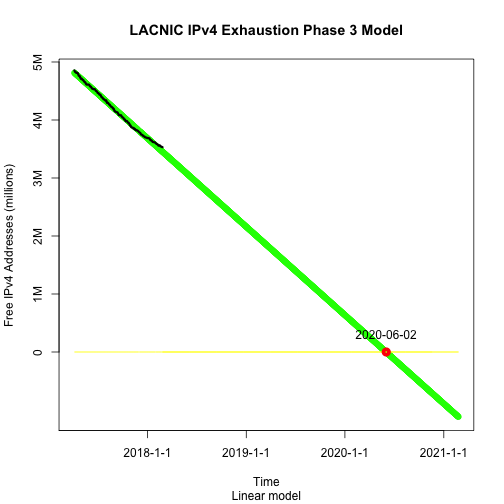

LACNIC IPv4 Phase 3 Report
========================================================
author: Carlos Martinez
date: February 21st, 2018
autosize: true

Relevant Policies and Data Sources Used 
========================================================

Phase 3 of IPv4 Runout began on February 15, 2017. Please see <http://www.lacnic.net/agotamiento>.

- The "Available IPv4 in LACNIC" dataset can be found at <http://opendata.labs.lacnic.net/ipv4stats/ipv4avail/lacnic?lastdays=320>.
- Reserved IPv4 space stands at 908800 IPv4 addresses as of today

Current Model (Deg. 1 Polynomial)
========================================================



Predicted Phase 3 End Date
========================================================


```
[1] "2020-06-02"
```
