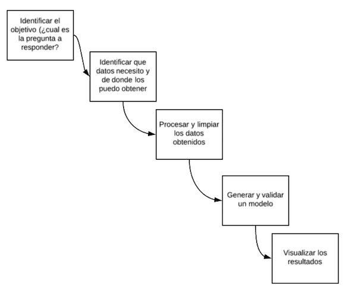
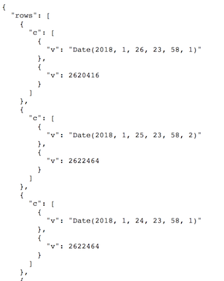
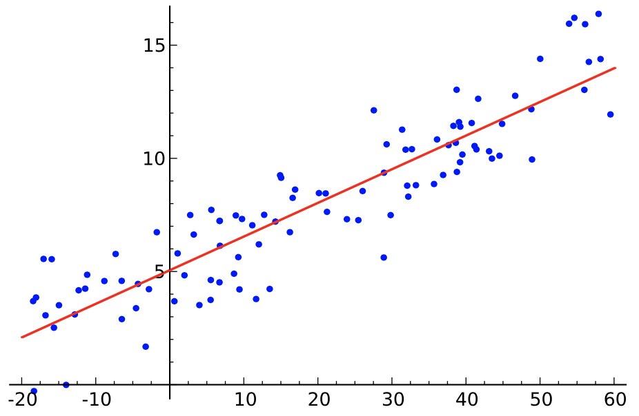

```{r setup, include=FALSE}
knitr::opts_chunk$set(echo = FALSE)
```

## Fases de un de modelado de datos



## Fase 1: ¿Cual es la pregunta que quiero responder?

_Dadas las políticas vigentes de asignación de IPv4 en la región de LACNIC, ¿hasta cuando va a durar el stock actual?_

### Política actual resumida:

- Asignación de IPv4 *únicamente a nuevos miembros*
- Asignaciones de *mínimo un /24 y máximo un /22*
- Las asignaciones son por *única vez*
- Los recursos recuperados aportan al pool de IPv4 de fase 3

## Fase 2: Identificar fuentes de información

- Idealmente necesito el "Stock de IPv4 libre como función del tiempo"
     - _free_ipv4 = f(t)_
     
- Pero:
     - El valor de "IPv4 libres" no está disponible directamente 
     - En realidad no son solo las libres sino que cuentan también las revocadas y reservadas

## Fase 2: Identificar fuentes de información (ii)

- La cantidad de *direcciones IPv4 que nunca han sido asignadas* se puede obtener procesando el "delegated-extended"
    - <http://ftp.lacnic.net/pub/stats/lacnic/delegated-lacnic-latest>
    - Pseudo-SQL: _"select where type=ipv4 and status=available"_

- La cantidad de *direcciones IPv4 producto de recuperación de recursos* hay que obtenerla de las IPs asignadas a tres org-ids: _UY-LRSP-LACNIC, MX-RERE-LACNIC y BR-RNRE-LACNIC_
    - Este es un "to-do", no tengo claro como hacerlo automáticamente todavía de una forma _transparente_

## Fase 3: Obtener, limpiar y acondicionar los datos 

- Procesar un delegated-extended me da *un punto* de la serie de datos que necesito
- Necesito todos los puntos desde el comienzo de la fase 3
- Por suerte ya lo veníamos haciendo en <http://opendata.labs.lacnic.net>
- Pero:
    - el formato en el cual está el json de esa página está diseñado para usar con Google Charts
    - hay que transformarlo en una serie de tiempos
      - aplanar la estructura
      - convertir las "Mongo Dates" en Unix timestamps
    
## Fase 3: Obtener, limpiar y acondicionar los datos 



## Fase 4: Proponer y visualizar un modelo

- Modelo: tratar de obtener *una expresión para la función que buscamos*
- Técnica más común: *Regresión por mínimos cuadrados* 



## Relevant Policies and Data Sources Used

Phase 3 of IPv4 Runout began on February 15, 2017. Please see <http://www.lacnic.net/agotamiento>.

- The "Available IPv4 in LACNIC" dataset can be found at <http://opendata.labs.lacnic.net/ipv4stats/ipv4avail/lacnic?lastdays=320>.
- Reserved IPv4 space stands at 908800 IPv4 addresses as of today

## Best Current Model

The current-best model is a _linear model_ (polynomial, degree=1)

```{r, echo=FALSE, message=FALSE, warning=FALSE}
source("freeipv4_model_f3.R")
```

## Phase 3 End Date - Current Prediction

```{r, echo=FALSE}
print(cutoff_date)
```


## DEMO

- Run DEMO now !!!!

## Thanks !!!

- Thank you very much for your time!
